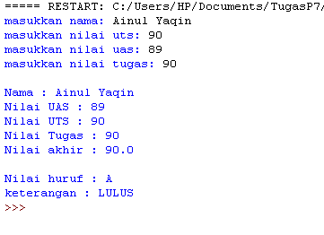
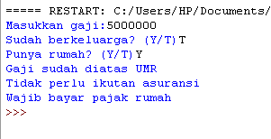
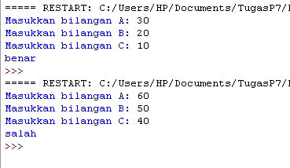
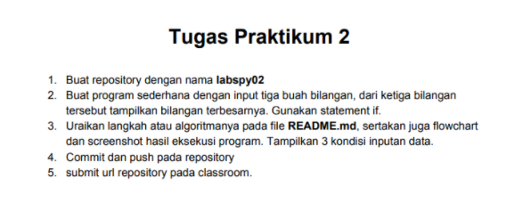
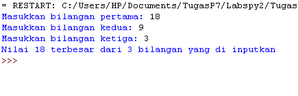
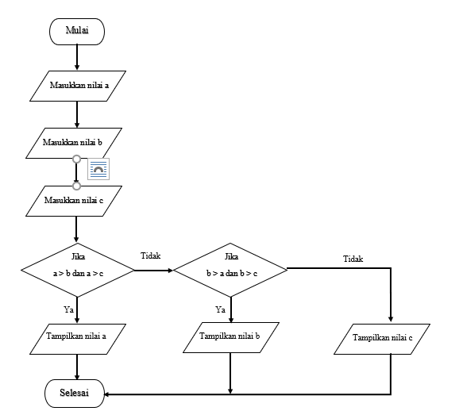

# **Modul Praktikum 2**

# Latihan 1: Membuat Program Menentukan nilai akhir

`nama = input('masukkan nama: ')`  
`uts = input('masukkan nilai uts: ')`  
`uas = input('masukkan nilai uas: ')`  
`tugas = input('masukkan nilai tugas: ')`  
`akhir = (int(tugas) * .2) + (int(uts) * .4) + (int(uts) * .4)M`  
`keterangan = ('TIDAK LULUS', 'LULUS')[akhir > 60.0]`  
`if akhir > 80:`  
`    huruf = 'A'`  
`elif akhir > 70:`  
`    huruf = 'B'`  
`elif akhir > 50:`  
`    huruf = 'C'`  
`elif akhir > 40:`  
`    huruf = 'D'`  
`else:` <br.>
`    huruf = 'E'`

`print("\nNama :",nama)`  
`print("Nilai UAS :",uas)`  
`print("Nilai UTS :",uts)`  
`print("Nilai Tugas :",tugas)`  
`print("Nilai akhir :",akhir)`  
`print("\nNilai huruf :",huruf)`  
`print("keterangan :",keterangan)`

**PENJELASAN**
* Masukkan nilai yang sudah di tentukan oleh variabel, seperti nama, uts, uas,tugas
* untuk akhir = (int(tugas) * .2) + (int(uts) * .4) + (int(uts) *.4)

Outpot :  

# Latihan 2 : Membuat Program Menampilkan Status Gaji Karyawan

`gaji = int(input("Masukkan gaji:"))`  
`berkeluarga = (False, True)[input("Sudah berkeluarga? (Y/T)") == "Y"]`  
`punya_rumah = (False, True)[input("Punya rumah? (Y/T)") == "Y"]`  
`if gaji > 3000000:`  
` print ("Gaji sudah diatas UMR")`  
` if berkeluarga:`  
`     print ("Wajib ikutan asuransi dan menabung untuk pensiun")`  
` else:`  
`     print("Tidak perlu ikutan asuransi")`  
` if punya_rumah:`  
`     print("Wajib bayar pajak rumah")`  
` else:`  
`     print("tidak wajib bayar pajak rumah")`  
`else:`  
`    print("Gaji belum UMR")`  

**PENJELASAN**  
Output :  

# Latihan 3: penggunaan kondisi OR program membandingkan 3 input bilangan, apabila penjumlahan 2 bilangan hasilnya sama dengan bilangan lainnya, maka cetak pernyataan “BENAR”  

`a = int(input('Masukkan bilangan A: '))`  
`b = int(input('Masukkan bilangan B: '))`  
`c = int(input('Masukkan bilangan C: '))`  
`if a+b == c or b+c == a or c+a == b:`  
`    print('benar')`  
`else: print('salah')`

**PENJELASAN**  
Output :  

# Tugas Praktikum 2  

`A = int(input('Masukkan bilangan pertama: '))`  
`B = int(input('Masukkan bilangan kedua: '))`  
`C = int(input('Masukkan bilangan ketiga: '))`  

`if A > B and A > C:`  
`    print('Nilai', A, 'terbesar dari 3 bilangan yang di inputkan')`  
`elif B > A and B > C:`  
`    print('Nilai', B, 'terbesar dari 3 bilangan yang di inputkan')`  
`else:`  
`    print('Nilai', C, 'terbesar dari 3 bilangan yang di inputkan')`

**PENJELASAN**  
Output :  

Flowchart  

